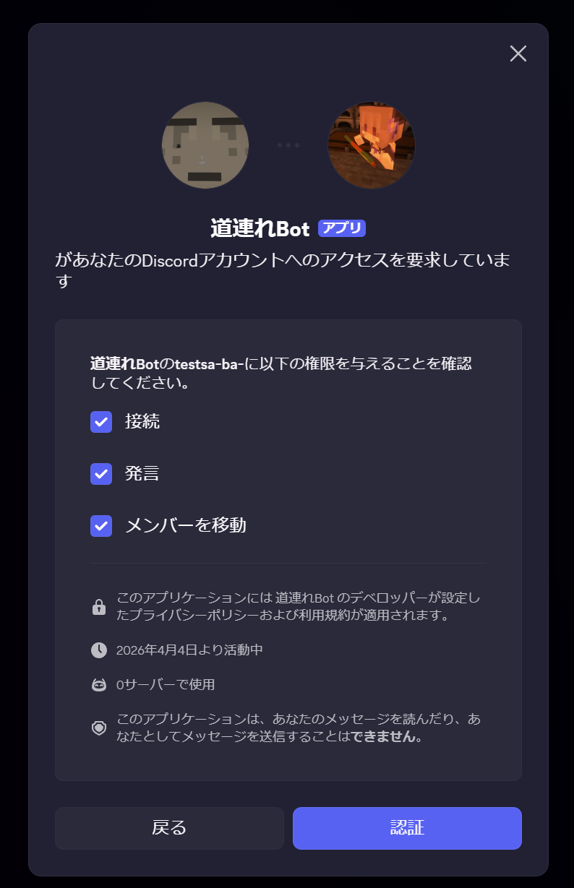

# michidurebot - Discord Bot

## 【michidurebotとは】
→ 抜け時を見失ったVCで強制退出させ夜更かしを防ぐためのdiscordのBot
### 機能
- ユーザはVC退出時刻を予約できます /setexittime
- 予約時刻にユーザがVCにいる場合、BotがVCに乱入しユーザを強制退出させます
- その際に退出BGMが流れます(音声ファイルはアップロードしていません)


## 【コマンドの使い方】
1. このBotが参加しているサーバーのテキストチャンネルを開く（BotとのDMでは使用不可）
2. メッセージ入力欄に半角スラッシュ「/」を入力（コマンド入力モードに入る）
3. 引数が必要なコマンドならば、表示される欄に値を入力する
4. 送信
> **注意**
> コマンドは全て実行者自身に対して行われる．(他人の退出予約を設定することはできない)
### __/setexittime コマンド__
```
→ VCの退出時刻を予約する

引数
- hour: 時  ← 0 ~ 23 までの整数
- minute: 分  ← 0 ~ 59 までの整数
- isshow: 表示設定(任意)  ← Falseなら自分だけに見えるメッセージになる．デフォルトでTrue

仕様
・退出したい時間を「時，分」で設定します．日付の繰上りは自動で行われます(例えば，現在が22:00で3時間後の01時に設定したい場合は，hour: 1, minute: 0 と設定します)
・既に予約がある状態で新たに作成した場合，上書きされます．同時に2つ以上の予約は作成されません．
・注意）サーバー間をまたいで退出予約は実行されません．(例えば，A鯖で予約し，該当時刻にB鯖のVCに接続していた場合は，B鯖において退出処理は行われず，登録済みの予約は削除されます)
```
### __/clearexittime コマンド__
```
→ VCの退出予約をリセット(削除)する

引数
- isshow: 表示設定(任意)  ← Falseなら自分だけに見えるメッセージになる．デフォルトでTrue
```
### /checkexittime コマンド
```
→ 現在の退出予約を確認する

引数
- isshow: 表示設定(任意)  ← Falseなら自分だけに見えるメッセージになる．デフォルトでTrue
```
### /checkexittime コマンド
```
→ 現在の退出予約を確認する

引数
- isshow: 表示設定(任意)  ← Falseなら自分だけに見えるメッセージになる．デフォルトでTrue
```
### /myexitcount コマンド
```
→ コマンド実行者の，これまでのこのBotによる強制退出が実行された回数を確認する


引数
- isshow: 表示設定(任意)  ← Falseなら自分だけに見えるメッセージになる．デフォルトでTrue
```
### /allexitcount コマンド 【管理者用】
```
→ 全員の強制退出回数を確認する

引数
- matchword: 合言葉
- isshow: 表示設定(任意)  ← Falseなら自分だけに見えるメッセージになる．デフォルトでTrue

仕様
使用には合言葉が必要ですが，スクリプトに直で書いています．
```
## 【Bot稼働に必要な権限】
Bot管理ページ Developer Portal の OAuth2 タブで指定する．このBotが正常に動作するために必要な権限は次の通り．(招待URL作成時に付与する)
- Scope
	- bot
	- applications.commands
- Bot permissions
	- Connect　←VC接続
	- Move Members　←VCで対象ユーザを移動(切断)させるため
	- Speak　←VCで音声を再生する際に必要



## 【Botの常時稼働】
- 自宅のミニPC(OS: Linux)に .py ファイルと，DiscordBotのトークンや，DiscordのチャンネルID，ユーザIDを記述した .env ファイルを配置
- xxx.service ファイルを作成して Active 状態になるように設定する
## 【ディレクトリ構造】
現時点(260405_0110)
```
[root]
|- data.json
|- drag_count.json
|- leaving-music-15dB.wav
|- leaving-music-long-15dB.wav
|- .env
\- michidure.py
```

## 【更新ログ】
- 260404_2107~  初着手
- 260405_0127~  readme.md作成
- 260405_0453~  運用開始